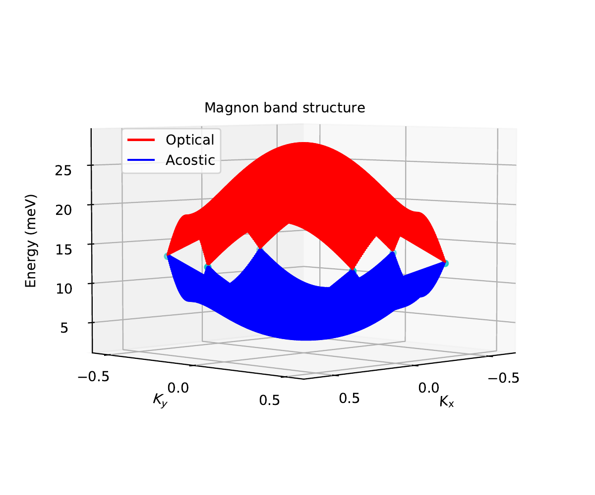
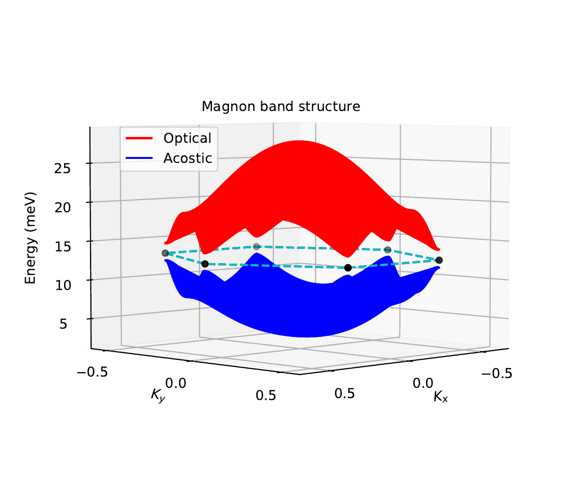

# 2D-Magnon-Topology
The Thermal Hall Effect of Magnon of 2D

- [Introduction](#introduction)
- [Project Technical Skills](#utilized-skills)
- [Data Visualization](#vizualization)  

## Introduction 

Recent experiments and theoretical work have shown that new 2D ferromagnetic systems exhibit bosonically
Dirac particles in their spin-wave spectrum.

## Project Skills 
- #### Data Cleaning
- #### Python

## Data Visualization 

    
    

